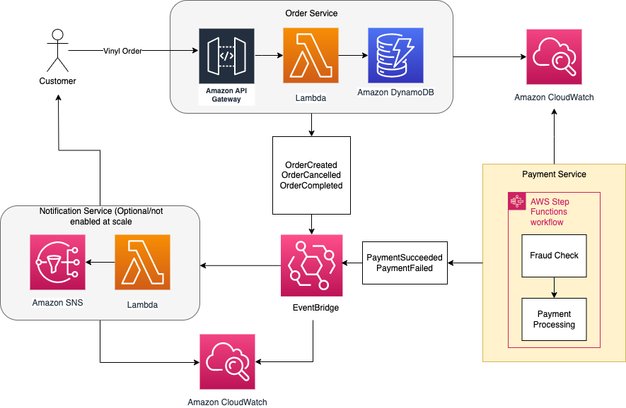

# AWS EDA Vinyl Shop



> Project referencing [tgpadua's project "aws-eda-demo"](<https://github.com/tgpadua/aws-eda-demo>)

## Overview

This project will create a vinyl record store order-processing application using AWS Event-Driven Architecture (EDA) services. The application will be built using the following AWS services:

- API Gateway
- Lambda
- Step Functions
- DynamoDB
- EventBridge
- SNS
- S3

## Getting Started

```bash
# Create AWS Resources
cd terraform
terraform init
terraform apply

# Test the AWS EDA Resources
python ./scripts/generate_user_orders.py --number-of-events 1
# Enter 'y' to generate the orders and create a local JSON file
python ./scripts/send_user_orders.py
# Enter 'yes' to send the orders to the API Gateway endpoint
# Verify the orders were processed by checking the DynamoDB table
```

## Next Steps

- [ ] Create a reporting system to visualize the orders
  - [ ] **Apache Superset** - Using the DynamoDB connector. I'm not super familiar with it and so far the experience has been incredible buggy and not straight forward
  - [ ] **AWS QuickSight** - This might be easier to get up and running with but the subscription cost is higher and I'd need to make sure to cancel it shortly after I'm done testing
- [ ] Add a Lambda function to the Step Function to send an email notification to the customer when the order is processed